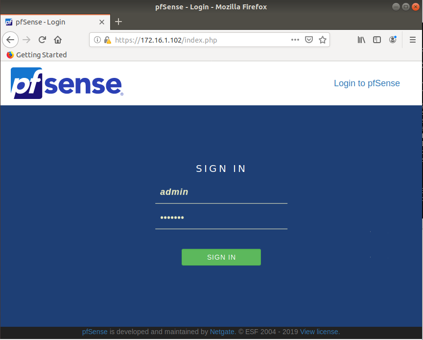

# Documentatie  Zulu1
## PfSense configuratie en setup
### Inlog gegevens webinterface

Admin account  
* username : admin  
* wachtwoord: Zulu1  

User1 account (Deze wordt later aangemaakt)  
* username : user1  
* wachtwoord: Zulu1User1  

### Manuele setup(Virtual box)

1. Download Pfsense iso file via [PfSense Website](https://www.pfsense.org/download/). 

2. Create Virtual Machine met type: BDS,versie:FREEBSD(64bit) en met opties TYPE:
    * Minstens 1024MB ram.
    * NAT NIC interface(WAN).
    * intern netwerk met keuze naamgeving(LAN).
3. Store iso in Virtual Machine.
4. Accepteer eerste pop-up venster.
5. Selecteer "Install". 
6. Kies een keymap(keylayout). 
7. Selecteer "Auto (UFS) : Guided Disk setup".
8. Wacht tot installatie voltooid, reboot system. 
9. Je wenst geen manuele modificatie uit te voeren, selecteer "No". 
10. Shutdown System. 
11. Verwijder iso file uit Virtual Machine. 
12. Start systeem terug op. 
11. Accepteer de Copyright notice. 
12. Kies voor "Set interface(s) IP Addresses".  
    * Kies een interface. 
    * Stel in volgens ip addresserings tabel. 
    * Stel subnet bit in volgens addresserings tabel.  
    * Geen DHCP.  
    * Indien bij WAN, IPV4 upstream gateway address wordt default gateway van het netwerk.  
    * Geen ipv6.  
    * geen reverting to HTTP. 

### Webinterface access

 1. Surf naar het ipadres van de LAN interface. 
 2. Login in met gepaste credentials.
    * Username : admin
    * Password : pfsense

### Configuratie
#### Admin account + account toevoegen
Verander het wachtwoord van de pfsense admin account.  

* Kies 'System' in de navigatiebalk.
* Ga naar 'User Manager' in het dropdown-menu.
* Klik op het potlood bij 'Admin' om de instellingen aan te passen.
* Verander het wachtwoord naar keuze. 

#### Setup-wizard

* Kies 'System' in de navigatiebalk.
* Volg de optie 'Setup Wizard' in het dropdown menu met volgende instellingen.
    * Hostname: Zulu1
    * Domain: green.local
* Kies de juiste timezone. 
* Verander wachtwoord naar keuze.
* Reload om de settings te herladen.
* Controleer juiste versie met 'Check for updates'.

#### Monitoring service: SNMP Daemon
Enable de 'SNMP Daemon service' voor monitoring.  

* Kies services in navigatiebalk. 
* Kies vervolgens voor 'SNMP' in het dropdown menu. 
* Enable de service   
    * Zorg ervoor dat de polling port op 161 staat.   
    * Zorg ervoor dat alle SNMP Module boxes aangeduid zijn.  
    * Selecteer de interface waar je de SNMP-deamon wilt binden. Doorgaans is dit de LAN-interface in uw pfsense. 

#### Aliasses

* Kies voor firewall in de navigatiebalk.
* Druk vervolgens alliases in het dropdown menu.
    * Naam: HTTP_HTTPS
    * Type: Port(s)
        * Port: 80 (HTTP)
        * Port: 443 (HTTP/S)
    * Naam: IMAP_IMAPS
    * Type: Port(s)
        * Port: 143 (IMAP)
        * Port: 993 (IMAP/S)
    * Naam: POP_POPS
    * Type: Port(s)
        * Port: 110 (POP3)
        * Port: 995 (POP/S)
* Apply Changes

##### HTTP_HTTPS

##### IMAP_IMAPS

##### POP_POPS

#### Firewall Rules

##### LAN RULES
Dit is standaard ingesteld en vereist geen verdere configuratie.

##### WAN RULES
Kies voor firewall in de navigatiebalk. Druk vervolgens alliases in het dropdown menu.

1. Toevoegen rules voor webserver(Echo1).

    * Action: Pass
    * Interface: WAN
    * Address Family: IPV4
    * Protocol: TCP
    * Source: ANY
    * Destination: Single host or alias (172.16.1.69)
    * Destination Port Range: 
        * other - custom (HTTP_HTTPS)

    Klik op Save om de instellingen te bevestigen.  

2. Toevoegen rules voor mailserver SMTP. 

    * Action: Pass
    * Interface: WAN
    * Source: ANY
    * Destination: Single host or alias (172.16.1.68)
    * Destination Port Range
        * SMTP(465) to SMTP(465)  

    Klik op Save om de instellingen te bevestigen.  

3. Toevoegen rules voor mailserver IMAP.

    * Action: Pass
    * Interface: WAN
    * Source: ANY
    * Destination: Single host or alias (172.16.1.68)
    * Destination Port Range: 
        * other - custom (IMAP_IMAPS)

    Klik op Save om de instellingen te bevestigen.

4. Toevoegen rules voor mailserver POP.
    * Action: Pass
    * Interface: WAN
    * Source: ANY
    * Destination: Single host or alias (172.16.1.68)
    * Destination Port Range: 
        * other - custom (POP_POPS)

    Klik op Save om de instellingen te bevestigen.

#### DCHP relay inschakelen

* Kies voor 'Services' in de navigatiebalk.
* Klik op 'DHCP Relay' in het dropdown menu.
* Enable
    * Interface: LAN
    * Destination Server: 172.16.1.1

#### DHCP server uitschakelen (LAN/WAN)

* Kies voor 'Services' in de navigatiebalk.
* Klik op 'DHCP Server' in het dropdown menu.
* Uncheck 'Enable DHCP' bij beide opties(LAN/WAN).

#### NAT uitschakelen

AAN TE VULLEN

#### DNS Resolver uitschakelen

* Kies voor 'Services' in de navigatiebalk.
* Klik op 'DNS Resolver' in het dropdown menu.
* Uncheck 'Enable DHCP' in General.

#### IPv6 uitschakelen

* Kies voor 'System' in de navigatiebalk.
* Klik op 'Advanced' in het dropdown menu.
* Klik vervolgens op 'Networking'.
* Uncheck 'Allow IPv6'

#### Routing

* Kies voor 'Interfaces' in de navigatiebalk.
* Klik WAN in het dropdown menu. 
* Verander de default gateway naar het ip van router0. 

Opgemaakt door: Olivier Troch en Joeri Verhavert